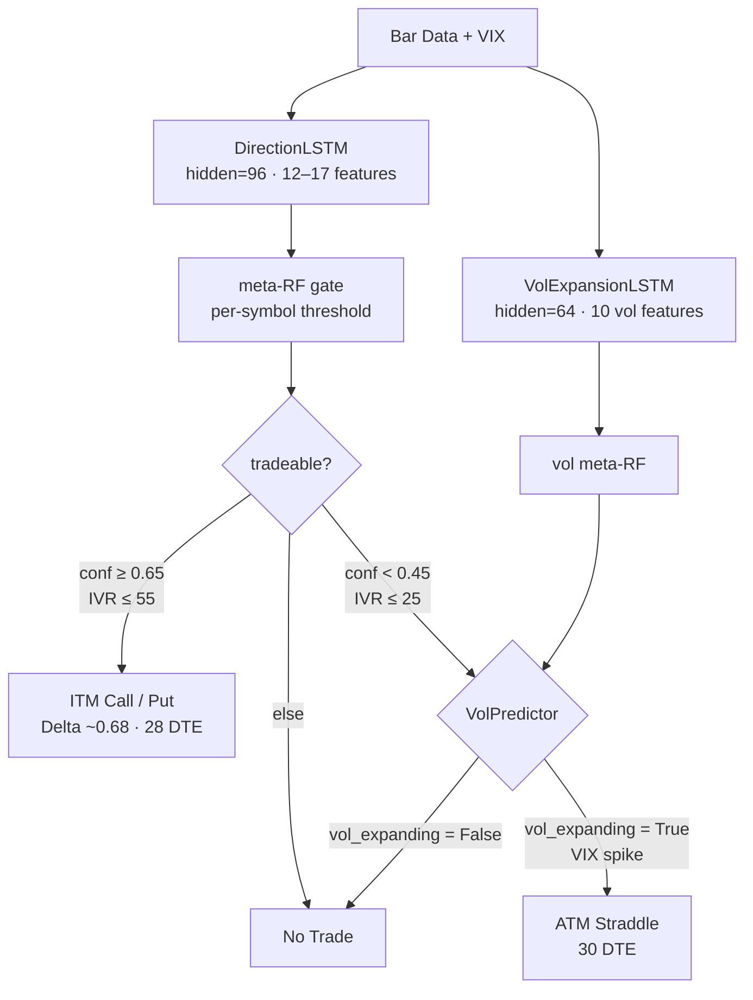
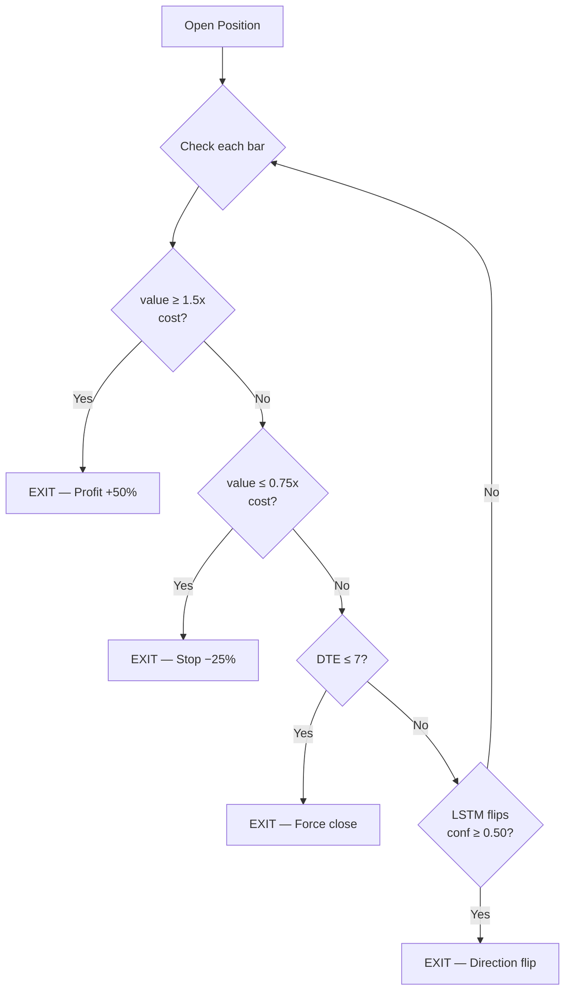
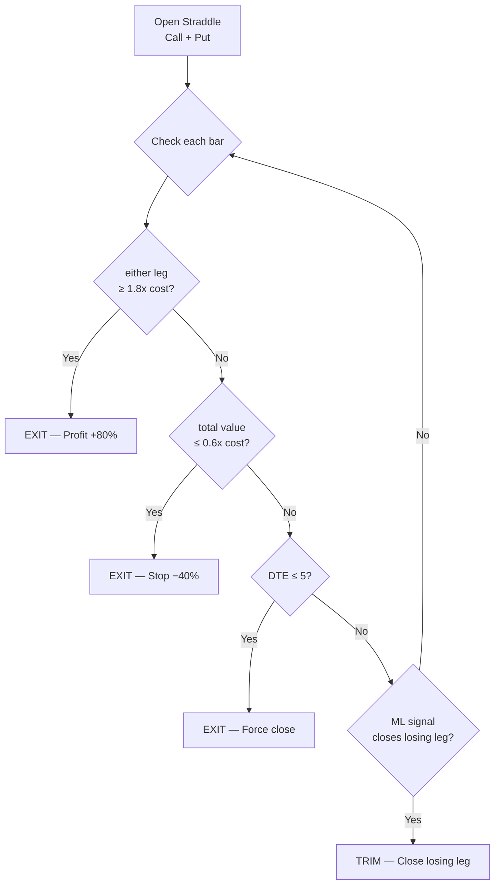
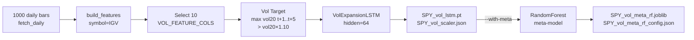
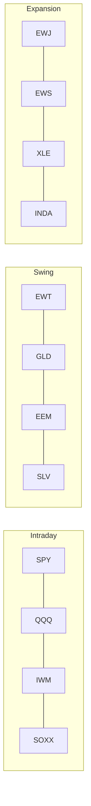

# Options ML Models — Overview

## System Architecture



---

## Model Comparison

| | Direction LSTM (paper trading) | Vol Expansion LSTM (options) |
|---|---|---|
| **Architecture** | `DirectionLSTM` (shared class) | `DirectionLSTM` (same class, reused) |
| **hidden_size** | 96 | 64 |
| **Features** | 12–17 trend/momentum features | 10 volatility-specific features |
| **Target label** | UP or DOWN (next bar direction) | Will vol20 expand ≥10% in next 5 bars? |
| **Output** | Direction probability | Vol expansion probability |
| **Model files** | `SPY_lstm.pt` / `SPY_lstm_5min.pt` | `SPY_vol_lstm.pt` |
| **Meta model** | `SPY_meta_rf.joblib` | `SPY_vol_meta_rf.joblib` |
| **Used for** | Stock trade entry (paper_trader.py) | Straddle timing — enter at low IV before expansion |
| **Training command** | `python main.py train --symbol SPY` | `python main.py train-vol --symbol SPY` |

Same PyTorch architecture, different training task. Similar to using ResNet for two different classification problems.

---

## Options Trading Strategies

| | Directional (ITM calls/puts) | Vol Expansion Straddle |
|---|---|---|
| **Signal source** | Direction LSTM (80%+ WR) | Vol Expansion LSTM + VIX spike |
| **Entry condition** | `tradeable=True` + `conf >= 0.65` + `IVR <= 55` | `IVR < 30` + `vol_expanding=True` + VIX spike |
| **Strike** | Delta ~0.68 ITM (BS d1 approximation) | ATM = round(current_price) |
| **Expiry** | ~28 DTE | ~30 DTE |
| **Profit target** | +50% (1.5x) | +80% on either leg (1.8x) |
| **Stop loss** | −25% (0.75x) | −40% total (0.6x) |
| **Force close** | 7 DTE | 5 DTE |
| **Extra exit** | LSTM direction flip (conf >= 0.50) | ML signal closes losing leg |
| **CLI flag** | `--strategy directional` | `--strategy straddle` |

---

## Exit Rule Decision Trees

### Directional (ITM Call/Put)



### Vol Expansion Straddle



---

## Vol Feature Columns (10 features)

```python
VOL_FEATURE_COLS = [
    "vol20",           # 20-day realized vol — primary expansion target
    "bb_bandwidth",    # Bollinger Band width — current vol regime
    "vol_regime",      # Vol regime (high/low)
    "bb_pct_b",        # Position within Bollinger Bands
    "ret5",            # 5-bar return
    "rsi14",           # RSI
    "vix",             # VIX level
    "vix_chg",         # VIX daily change
    "momentum_quality",# Momentum quality score
    "adx",             # ADX — trend strength
]
```

> **Note:** `build_features(symbol="IGV")` is used internally to get the 17-feature superset
> that includes `vix`, `vix_chg`, and `momentum_quality` (not in the standard 12-feature daily set).

---

## Training Pipeline



### Vol Expansion Target

```
label[t] = 1  if max(vol20[t+1 .. t+5]) > vol20[t] * 1.10
           0  otherwise
```

Predicts whether realized 20-day volatility will expand by ≥10% in the next 5 bars.

---

## Training Commands

```bash
# Train vol model for one symbol
python main.py train-vol --symbol SPY --epochs 50

# Train with meta RF for higher precision
python main.py train-vol --symbol SPY --with-meta

# Train all 12 active symbols (+ meta RF for each)
python scripts/retrain_all.py --step vol

# Train everything: direction LSTM + meta RF + vol LSTM + vol meta RF
python scripts/retrain_all.py --step all
```

## Backtest Commands

```bash
# Backtest directional ITM options
python main.py backtest-options --symbol SPY --start 2024-01-01 --strategy directional

# Backtest straddle strategy
python main.py backtest-options --symbol SPY --start 2024-01-01 --strategy straddle

# Backtest both strategies (two-section report)
python main.py backtest-options --symbol QQQ --start 2024-01-01

# Paper trade
python main.py trade-options --strategy directional --symbols SPY,QQQ
python main.py trade-options --strategy straddle    --symbols SPY,QQQ
python main.py trade-options --strategy both
```

---

## Active Symbols (options)



> TLT, IGV, FXI excluded — poor directional win rate.
